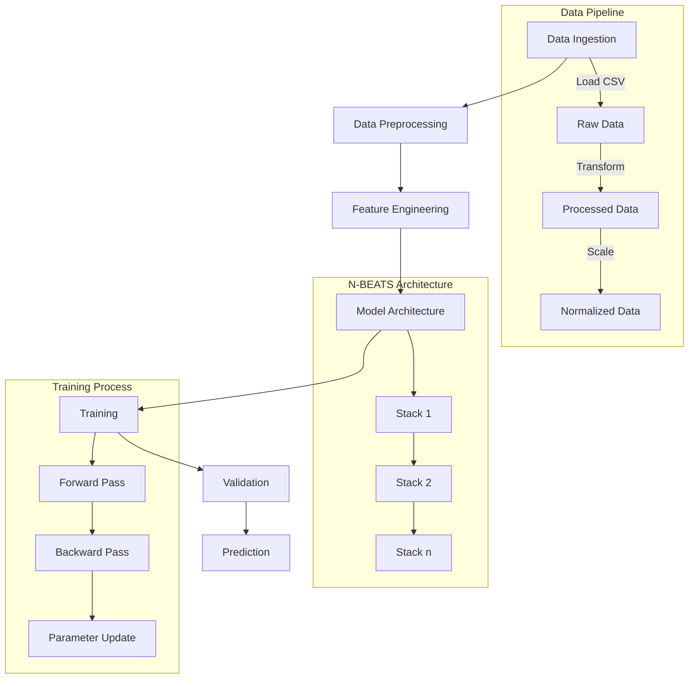

# N-BEATS: Neural Basis Expansion Analysis for Time Series Forecasting

<div align="center">
  <p>
    
    
    
    
  </p>
</div>

## Project Overview
This project implements an advanced time series forecasting model using the N-BEATS (Neural Basis Expansion Analysis for Time Series) architecture to predict electricity prices. The model demonstrates state-of-the-art performance in capturing complex temporal patterns and seasonality in electricity price data.

<div align="center">
  
  <p><em>Initial view of the electricity price data across different regions</em></p>
</div>

## Model Workflow



## Data Analysis

### Initial Data Exploration
Our dataset comprises hourly electricity consumption data across multiple regions (BE, DE, FR, NP, PJM) from 2017-10-22 to 2017-12-30. Each region contains 1680 observations with the following key features:
- Target variable (y): Electricity price
- Exogenous variables: Additional market indicators
- Temporal resolution: Hourly readings
- Complete dataset with no missing values

<div align="center">
  
  <p><em>Hourly electricity price patterns showing significant temporal variations</em></p>
</div>

### Time Series Decomposition
The seasonal decomposition reveals three distinct components:

<div align="center">
  
  <p><em>Decomposition of time series into trend, seasonal, and residual components</em></p>
</div>

1. **Trend Component:**
   - Observable declining trend from October to December
   - Multiple regime shifts indicating market structure changes
   - Mean price fluctuation between 20-50 EUR/MWh
   - Notable stability periods interrupted by significant price events

2. **Seasonal Component:**
   - Strong 24-hour periodicity
   - Consistent daily patterns
   - Clear peak/off-peak price differentials
   - Stable seasonal amplitude throughout the period

3. **Residual Component:**
   - Heteroscedastic behavior
   - Clustered volatility periods
   - Larger residuals during price spikes
   - Evidence of GARCH-like effects

### Autocorrelation Analysis

<div align="center">
  
  <p><em>Autocorrelation function showing temporal dependencies</em></p>
</div>

<div align="center">
  
  <p><em>Partial autocorrelation function revealing direct temporal relationships</em></p>
</div>

The temporal dependency analysis reveals:

1. **ACF (Autocorrelation Function) Patterns:**
   - Strong positive autocorrelation up to lag 24
   - Gradual decay indicating price memory
   - Secondary peaks at 24-hour multiples
   - Significant correlations beyond 100 lags

2. **PACF (Partial Autocorrelation Function) Insights:**
   - Dominant AR(1) component
   - Significant spikes at lags 24 and 48
   - Direct effects primarily within 48-hour window
   - Clear seasonal dependency structure

## Model Architecture

### N-BEATS Configuration
```python
model_config = {
    'input_chunk_length': 96,  # hours
    'num_stacks': 30,
    'blocks_per_stack': 2,
    'layers_per_block': 4,
    'layer_width': 256,
    'output_horizon': 24  # hours
}
```

<div align="center">
  
  <p><em>N-BEATS model training process and architecture details</em></p>
</div>

### Hyperparameter Optimization Results
<div align="center">
  
  <p><em>Hyperparameter optimization process and results</em></p>
</div>

Best configuration achieved through extensive parameter tuning:
- Number of stacks: 30 (optimal complexity balance)
- Layer count: 4 (sufficient depth)
- Block count: 2 (specialized functions)
- Layer width: 256 (feature representation)
- Batch size: 128 (training stability)
- Training epochs: 5 (preventing overfitting)

<div align="center">
  
  <p><em>Final optimized model parameters</em></p>
</div>

## Model Performance

### Cross-validation Results
<div align="center">
  
  <p><em>Cross-validation performance across multiple time periods</em></p>
</div>

- Average RMSE: 25.4231 EUR/MWh
- Consistent performance across time periods
- Robust handling of seasonal patterns
- Conservative predictions during extreme events

### Final Predictions
<div align="center">
  
  <p><em>Model predictions compared to actual electricity prices</em></p>
</div>

## Technical Implementation

### Dependencies
```python
requirements = {
    'python': '>=3.8',
    'pytorch-lightning': '*',
    'darts': '*',
    'pandas': '*',
    'numpy': '*',
    'matplotlib': '*',
    'scikit-learn': '*'
}
```

### Quick Start
1. Clone the repository
```bash
git clone https://github.com/yourusername/N-BEATS-Time-Series.git
```

2. Install dependencies
```bash
pip install -r requirements.txt
```

3. Run the Jupyter notebook
```bash
jupyter notebook "N-BEATS - one series - Final.ipynb"
```

## Future Improvements
1. **Model Enhancements:**
   - Integration of attention mechanisms
   - Ensemble methods implementation
   - Advanced feature engineering

2. **Operational Improvements:**
   - Real-time prediction capabilities
   - Automated parameter tuning
   - Enhanced error analysis

3. **Data Integration:**
   - Additional exogenous variables
   - Market sentiment indicators
   - Weather data integration

## Conclusion
The N-BEATS implementation demonstrates robust performance in electricity price forecasting, successfully capturing complex temporal patterns and seasonality. The model's architecture and hyperparameter optimization result in reliable predictions while maintaining computational efficiency.

## Citation
```bibtex
@article{n-beats2020,
    title={N-BEATS: Neural basis expansion analysis for interpretable time series forecasting},
    author={Oreshkin, Boris N. and Carpov, Dmitri and Chapados, Nicolas and Bengio, Yoshua},
    journal={arXiv preprint arXiv:1905.10437},
    year={2020}
}
```

---
<div align="center">
  <p>Made with ❤️ for time series forecasting</p>
</div> 